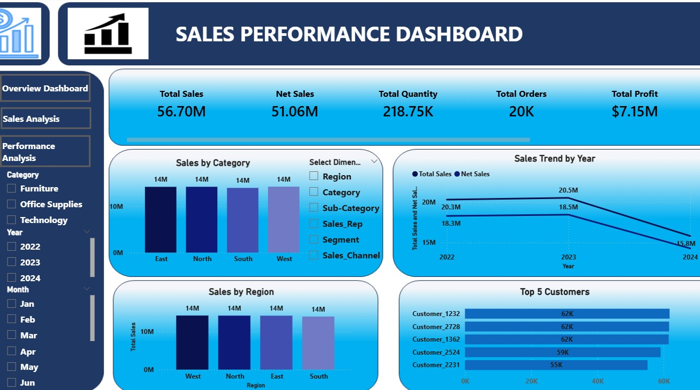
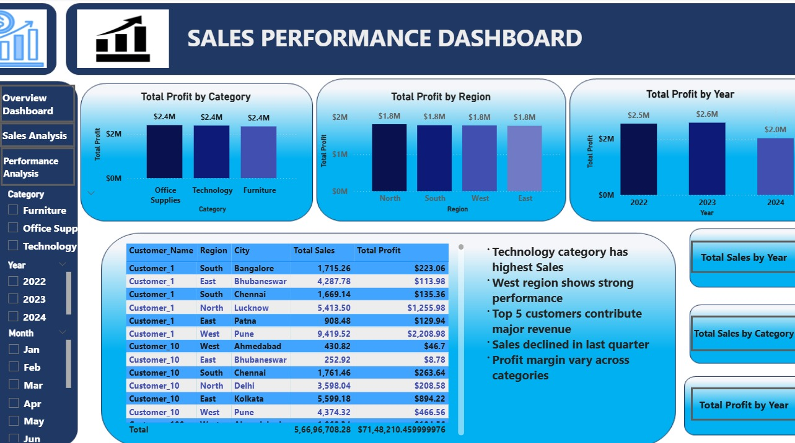
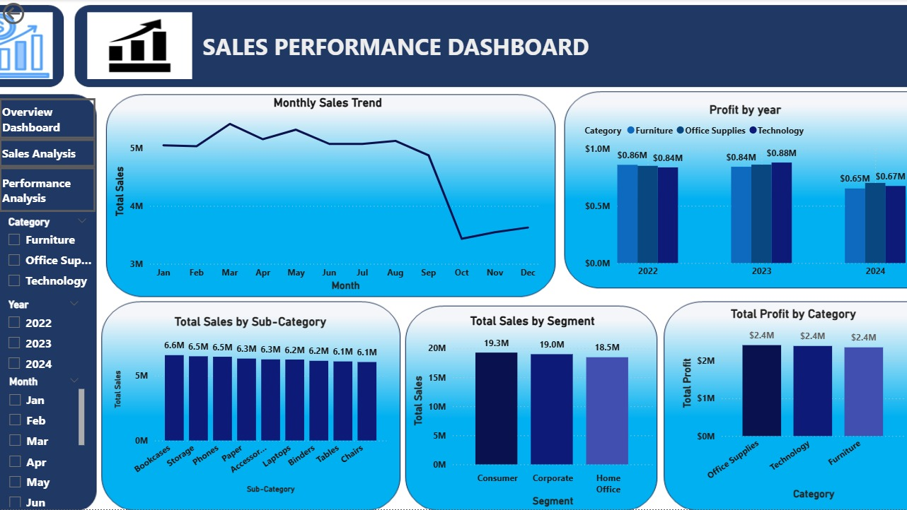

# Sales Performance Dashboard

## Project Overview
This project focuses on analyzing sales data to track business performance across regions, categories, and customer segments using SQL, Excel, and Power BI. The dashboard provides actionable insights to support data-driven decision-making.

## Objectives
- Monitor key performance indicators (KPIs) such as total sales, net sales, profit, and average order value
- Analyze sales performance across regions, customer segments, and product categories
- Identify top-performing and low-performing areas
- Understand the impact of discounts on sales and profitability

## Key Metrics
- Total Sales
- Net Sales
- Profit
- Average Order Value (AOV)
- Discount Impact
- Sales by Region
- Sales by Customer Segment

## Key Insights
- Identified top-performing regions contributing to higher revenue
- Analyzed how discounts impact profit and sales performance
- Highlighted low-performing regions and customer segments
- Provided recommendations to improve sales performance and profitability

## Tools Used
- SQL (Data analysis)
- Excel (Data cleaning and preprocessing)
- Power BI (Dashboard development and visualization)

## Process
- Imported raw sales dataset
- Cleaned and transformed data using Excel
- Analyzed data using SQL queries
- Built data model using star schema in Power BI
- Created interactive dashboard with multiple pages:
  - Page 1: Overview (KPIs and summary)
  - Page 2: Detailed Analysis (region, category, segment)
  - Page 3: Insights and recommendations

## Dashboard Features
- Interactive filters (region, category, segment)
- KPI cards for quick insights
- Trend analysis using charts
- Visual comparison of performance across regions and categories

## Dashboard Preview

